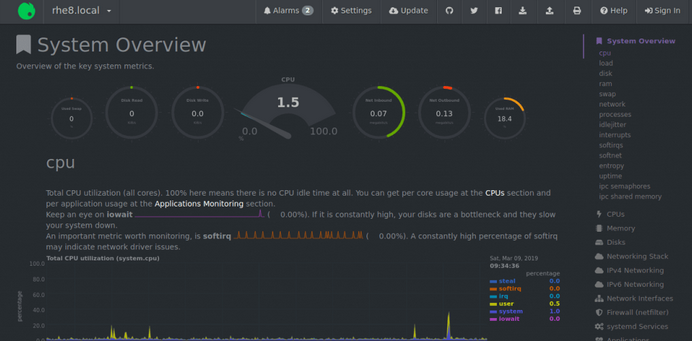

# TP 1 - B2

## I. Gather informations

 ° ```ip a``` permet de recuperer toutes les infos

 ° déterminer si les cartes réseaux ont récupéré une IP en DHCP ou non : ```sudo nmcli -f DHCP4 con show ens32``` Moi j'en ai pas
 

 ° afficher la table de routage de la machine et sa table ARP : ```ip neighbour show et ip route show ```
 
 première ligne est ma carte réseau
 deuxieme ligne est mon ordi connecté
 troisieme ligne gateway

 °récupérer la liste des ports en écoute (listening) sur la machine (TCP et UDP) : ```ss -t et ss -u```
 

 ° récupérer la liste des DNS utilisés par la machine et de reddit : ```dig localhost et dig www.reddit.com```
 
    server DNS ok

 °  afficher l'état actuel du firewall : ```firewall-cmd --list-all```
        

 - quelles interfaces sont filtrées ? : ens32

 - quel port TCP/UDP sont autorisés/filtrés ? aucun ports filtrés ```firewall-cmd --list-post```
## II. Edit configuration

### 1. configuration carte réseau

 - mettre une ip statique manuellement il faut aller : ```/etc/sysconfig/network-scripts/ifcfg-eth0``` puis tu ajoute 
IPADDR=172.16.1.115
NETMASK=255.255.255.0
GATEWAY=172.16.1.1

   et tu change BOOTPROTO = dhcp ---> BOOTPROTO = static

- vérifier les changements 
    - ip :
    

    - arp :
    

- NIC 
    - 
        ens32 et ens35 même réseau

    -  mettre en place un NIC teaming (ou bonding)
        

### 2. SSH

- modification du port 22 en port 2222 dans les fichiers ssh : /etc/ssh/sshd_config puis ```systemctl restart sshd```

[root@glynsh ~]# firewall-cmd --permanent --add-port=2222/tcp
success
[root@glynsh ~]# systemctl restart firewalld

[root@mother ~]# ssh root@192.168.5.10 -p 2222 -i id_rsa


## Cockpit 

Install : ``` sudo dnf install -y cockpit sudo systemctl start cockpit ```

On vérifie qu'il écoute sur les bon ports : ```ss -tlpna```

On ajoute le port sur le firewall : ```firewall-cmd --permanent --add-port=9090/tcp```


## netdata

instalation : ```bash <(curl -Ss https://my-netdata.io/kickstart.sh)```

firewall : ```firewall-cmd --permanent --add-port=19999/tcp```

Netdata est un moniteur qui gère la performance d'un server. 
Nous retrouvons donc un dashboard qui résume l'état de la machine.



en l'installant sur les deux machines nous pouvons centraliser les informations en une seule en créant un compte netdata.


