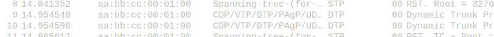

# TP - 2 Network low-level, Switching

## I. Simplest setup

mettre en place la topologie


faire communiquer les deux PCs


déterminer le protocole utilisé par ping à l'aide de Wireshark

protocol STP/DTP


echange arp


récapituler toutes les étapes quand pc1 ping pc2

1. (PC1 ping PC2)
2. (PC2 MAC not found ON PC1)
3. (PC1 ARP request)
    [PROTOCOL ARP]
4. (PC2 informations (MAC / IPADDR PC1) imported into ARP TABLE) 
5. (PC1 : ping) -----> (PC2)
    [PROTOCOL ICMP]
6. (PC1) ----> (echo request) ----> (PC2)
7. (PC 2 ARP REQUEST TO PC1)
8. (PC1) <---- (echo reply) <------ (PC2)

Pourquoi le switch n'a pas besoin d'IP ?
Car il travail en couche 2

pourquoi les machines ont besoin d'une IP pour pouvoir se ping ?
Ping utilise le protocole ICMP donc a besoin d'être enpaqueté dans une TRAME ip

## II. More switches


faire communiquer les machines:


show mac address-table:


ces lignes montrent l'addresse MAC des equipements du réseau que connait le Switch.

CDP (Cisco discovery protocol) permet de trouver des peripheriques voisins directement connectés au switchs.

### Mise en évidence du Spanning Tree Protocol

Determiner les informations STP
```show spanning-tree```
[stp](img/STP.png)

```                                        Root bridge

+-------------+            priority 32769+-------------+       +--------------+
|             |                         +              | +---> |              |    priority : 24577            +----------------+
|    PC1      |                         |   S1         +-------+       S2     |                                |                |
|             +-------------------------+              | F0/1  |              +--------------------------------+       PC3      |
| 172.17.10.21|                         |              |       |              |                                |                |
|             | F0/11                   +------+-------+       +----------+---+                           F0/6 |  172.17.10.23  |
+-------------+                                |    F0/2                  |   F0/1                             +----------------+
                                               | ^                     ^  |
                                               | |                     |  |
                                               | |                     |  |
                                               | |                     |  |
                                               | |                     |  |
                                               | |    F0/2     F0/1    |  |
                                               | +  +----------------+ +  |
                                               |    |                |    |
                                               +----+                |    |
                                                    |       S3       +----+
                                                    |                |     priority 32769
                                                    +--------+-------+
                                                             +
                                                           F0/18
                                                             +
                                                             |
                                                             |
                                                             |
                                                             |
                                                             |
                                                             |
                                                             |
                                                             |
                                                             |
                                                             |
                                                             |
                                                             |
                                                     +-------+--------+
                                                     |                |
                                                     |      PC2       |
                                                     |                |
                                                     | 172.17.10.22   |
                                                     +----------------+

```

