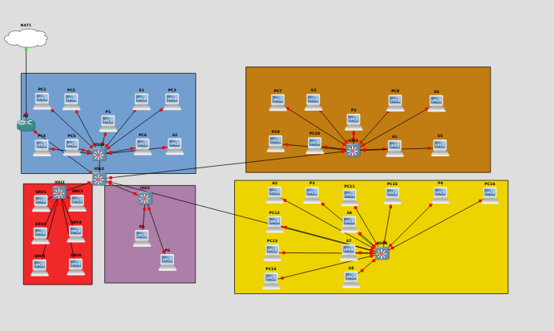

# TP3

## I. Router-on-a-stick

**Schéma :**

``` ascii
             +--+
             |R1|
             +-++
               |
               |                    +---+
               |          +---------+PC4|
+---+        +-+-+      +---+       +---+
|PC1+--------+SW1+------+SW2|
+---+        +-+-+      +-+--+
               |          |  |
               |          |  +------+--+
               |          |         |P1|
             +-+-+      +-+-+       +--+
             |PC2|      |PC3|
             +---+      +---+
```

**Tableau des réseaux utilisés :**

Réseau | Adresse | VLAN | Description
--- | --- | --- | ---
`net1` | `10.3.10.0/24` | 10 | Utilisateurs
`net2` | `10.3.20.0/24` | 20 | Admins
`net3` | `10.3.30.0/24` | 30 | Visiteurs
`netP` | `10.3.40.0/24` | 40 | Imprimantes

**Tableau d'adressage :**

Machine | VLAN | IP `net1` | IP `net2` | IP `net3` |  IP `netP`
--- | --- | --- | --- | --- | ---
PC1 | 10 | `10.3.10.1/24` | x | x | x
PC2 | 20 | x | `10.3.20.2/24` | x | x | x
PC3 | 30 | x | `10.3.20.3/24` | x | x | x
PC4 | 30 | x | x |  `10.3.30.4/24` | x | x
P1 | 40 | x | x | x | `10.3.40.1/24`
R1 | x |  `10.3.10.254/24` | `10.3.20.254/24` | `10.3.30.254/24` | `10.3.40.254/24`

### Configuration des clients et de l'imprimantes

[script de configuration](./P1/script-pc.sh)

### Configuration du routeur

[script de configuration](./P1/script-router.sh)

### Configuration du switch

[script de configuration](./P1/script-switch.sh)

### Vérification

Il suffit de faire quelques pings afin de vérifier que les machines communiques ou non.

```cisco
PC2> ping 10.3.30.4 #PC4
84 bytes from 10.3.30.4 icmp_seq=1 ttl=63 time=14.649 ms
84 bytes from 10.3.30.4 icmp_seq=2 ttl=63 time=11.402 ms
84 bytes from 10.3.30.4 icmp_seq=3 ttl=63 time=13.629 ms
84 bytes from 10.3.30.4 icmp_seq=4 ttl=63 time=13.996 ms
^C
PC2> ping 10.3.10.1 #PC1
10.3.10.1 icmp_seq=1 timeout
10.3.10.1 icmp_seq=2 timeout
10.3.10.1 icmp_seq=3 timeout
10.3.10.1 icmp_seq=4 timeout
10.3.10.1 icmp_seq=5 timeout
```

PARDON Leo ca rassemble a ce qu'a fait antoine mais mon MD a sauté avec cette histoire de sous module mais j'ai fais tout ça. preuve dans mes scripts :3

## II. Cas concret

### Théoriquement



Cables necessaires : 
- Court : 6 (salle de serveur)
- Moyen : 22 (le reste)
- Long  : 5 (switch connecté au routeur et aux autres pc)

### Tableau d'adressage

| Machines    | IP               | Réseau           | Masque          | Vlan |
|:-----------:|:----------------:|:----------------:|:---------------:|:----:|
| PC1-16      | 192.168.10.1-16  | 192.168.10.0/27 | 255.255.255.224 | 10   |
| S1-8        | 192.168.20.1-8   | 192.168.20.0/28 | 255.255.255.240 | 20   |
| P1-5        | 192.168.30.1-5   | 192.168.30.0/28 | 255.255.255.240 | 30   |
| A1-3        | 192.168.40.1-3   | 192.168.40.0/29 | 255.255.255.248 | 40   |
| SRV2-5      | 192.168.50.1-4   | 192.168.50.0/29 | 255.255.255.248 | 50   |
| SRV1&6      | 192.168.60.1-2   | 192.168.60.0/29 | 255.255.255.248 | 60   |

| Interfaces  | IP               | Réseau           | Masque          | Vlan |
|:-----------:|:----------------:|:----------------:|:---------------:|:----:|
| eth1/0.10     | 192.168.10.30    | 192.168.10.0/27 | 255.255.255.224 | 10   |
| eth1/0.20     | 192.168.20.14    | 192.168.20.0/28 | 255.255.255.240 | 20   |
| eth1/0.30     | 192.168.30.14    | 192.168.30.0/28 | 255.255.255.240 | 30   |
| eth1/0.40     | 192.168.40.6     | 192.168.40.0/29 | 255.255.255.248 | 40   |
| eth1/0.50     | 192.168.50.6     | 192.168.50.0/29 | 255.255.255.248 | 50   |
| eth1/0.60     | 192.168.60.6     | 192.168.60.0/29 | 255.255.255.248 | 60   |

| Vlans       | Nom                                 |
|:-----------:|:-----------------------------------:|
| 10          | Utilisateurs                        |
| 20          | Stagiaires                          |
| 30          | Imprimantes                         |
| 40          | Administrateurs                     |
| 50          | Serveurs                            |
| 60          | Serveurs sensibles                  |

